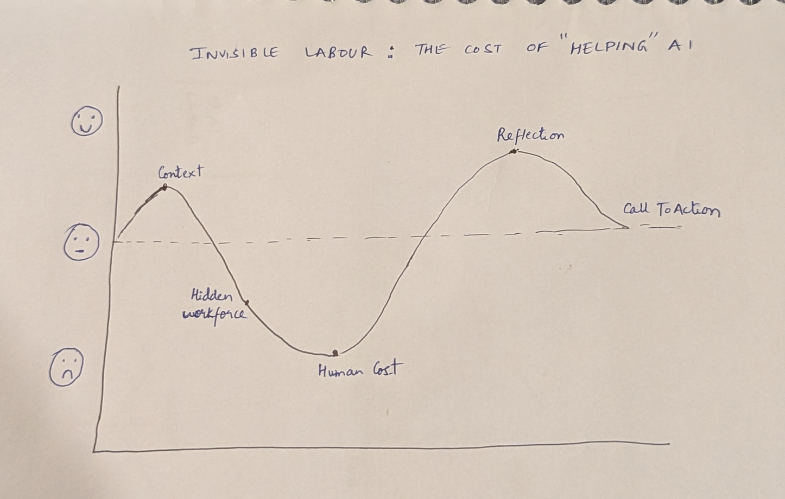
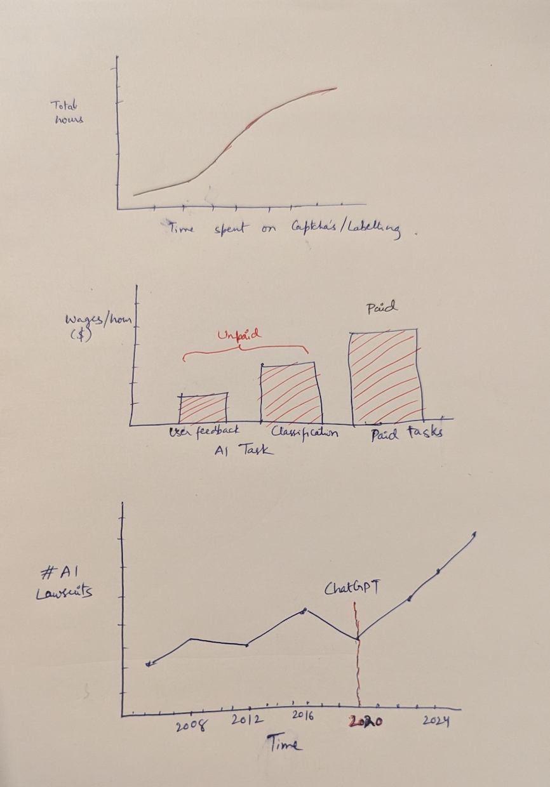

| [home page](https://ashishpcmu.github.io/dataviz-portfolio/) | [data viz examples](dataviz-examples) | [critique by design](critique-by-design) | [final project I](final-project-part-one) | [final project II](final-project-part-two) | [final project III](final-project-part-three) |

# Outline

Artificial intelligence is everywhere—from your search engine results and virtual assistants to recommendation engines, image generators, and chatbot companions. These technologies appear seamless, smart, and almost magical. But what we don’t see is the massive, hidden workforce behind them—humans who spend long hours labeling images, moderating toxic content, and training models to act more "intelligent."

This hidden workforce is often located in developing countries, working under precarious conditions, for wages as low as $1.50 per hour. These people are the invisible labor behind AI. They power every impressive interaction we have with AI systems, yet their stories are rarely told. This project brings their work to the forefront—shedding light on how artificial intelligence depends not just on algorithms, but on human labor, often cheap and unrecognized.

We want to unpack the true cost of training AI, not just in dollars and compute, but in human lives, labor, and ethics. Using real data, global maps, and worker testimonies, our story reveals what it takes to “teach” a machine—and how the burden of that teaching falls on the world’s most vulnerable workers.

## Goal, Target Audience & Call to Action

## Goal Statement

Our goal is to expose and explain the hidden human labor required to train modern AI systems. We aim to educate audiences on the scale of this labor, the conditions under which it's performed, and the ethical questions it raises about fairness, transparency, and exploitation.

## Target Audience

- The general public who interact with AI tools daily.

- AI developers and product designers in tech companies.

- Journalists, educators, and students researching AI ethics.

- Policymakers and activists focused on labor rights and technology governance.

## Call to Action

- Recognize the human effort behind AI.

- Demand fair pay and mental health protections for data workers.

- Support policies that make AI supply chains transparent and ethical.

## Project Structure & Story Flow
> A project structure that outlines the major elements of your story.  Your Good Charts text talks about story structure in Chapter 8 - you should describe what you hope to achieve.  Make sure the outline is detailed enough that we can see how you anticipate your story unfolding.  You can incorporate your Story Arc from the in-class exercise along with your user stories and one sentence summary to make the topic even more clear.

### Section 1 - Introduction: The Illusion of Automation

We begin with a simple but provocative idea: AI isn’t as autonomous as it looks. From chatbots to self-driving cars, most AI systems rely heavily on data labeled by humans. This section introduces the reader to the concept of invisible labor and asks: If machines are learning, who are their teachers?

### Section 2 - What is Invisible Labor in AI?

This section defines the types of tasks human workers perform:

- Image labeling (e.g., "Is this a cat?")

- Moderating offensive or violent content

- Answering questions to train chatbots

- Ranking search engine results

We introduce key platforms like Amazon Mechanical Turk, Scale AI, Appen, and Sama, where such labor is outsourced.

### Section 3 - Mapping the Global Workforce

Using a heatmap, we show how companies in Silicon Valley outsource labor to places like Kenya, the Philippines, Venezuela, and India. This section highlights economic disparities and visualizes global outsourcing pipelines.

### Section 4 - The Human Cost

Here we show:

- Wage comparisons (labelers vs. AI engineers)

- Mental health impacts of viewing disturbing content daily

- Worker testimonials from TIME, MIT Tech Review, and Fairwork reports

This is the emotional heart of the story. We want the audience to feel the weight of these workers’ experiences.

### Section 5 - What Can Be Done?
The final section contrasts two possible futures:

- Business-as-usual: Continued exploitation and opacity

- Fair AI future: Transparent sourcing, ethical guidelines, living wages

- We call on tech companies, consumers, and regulators to prioritize the latter.

## Initial sketches

- Below are images of anticipated data visualizations. They show how much AI human labour goes into training, and the exploitation of workers. 

 

 

- Line chart: Time spent in AI labelling tasks

- Bar Chart: Wage comparison – AI engineers ($150K) vs. data annotators (<$5/hr)

- Time series chart: #AI Lawsuits increased over time

- Quote Visuals: Real testimonials pulled from interviews and reports

# The data

### Available Data Sources

We will draw from a combination of public datasets, academic research, investigative journalism, and nonprofit reports to build a holistic picture of invisible labor in AI.

Available Data Sources
ILOSTAT – International Labour Organization
Useful for comparing average wages and working hours across countries.

World Bank Data
Global economic indicators, labor participation rates, and wage comparisons.

Fairwork Ratings & Reports
Data on working conditions of digital labor platforms.

Upwork & MTurk Data Collection
Information on task pricing, job types, and worker testimonials.

Appen & Sama Public Reports
Case studies and transparency reports from major annotation firms.

Research Reports
Name	URL	Description
Ghost Workers (Gray & Suri)	https://ghostworkers.info	Foundational book on the global workforce behind AI
MIT Tech Review – The Hidden Human Labor Behind AI	https://www.technologyreview.com/2021/03/18/1020600/the-hidden-human-labor-behind-artificial-intelligence/	Investigative deep-dive on invisible labor
TIME – Inside OpenAI’s Outsourced Workforce	https://time.com/6147458/openai-chatgpt-kenya-workers/	Firsthand stories of Kenyan labelers for OpenAI
Partnership on AI – Responsible Sourcing	https://partnershiponai.org/responsible-sourcing-of-data-enrichment-services/	Frameworks for ethical AI labor practices
Fairwork – Ratings of Labor Platforms	https://fair.work/en/fw/homepage/	Comparative data on labor platforms like Appen, Clickworker, etc.
Text here...

> A link to the publicly-accessible datasets you plan on using, or a link to a copy of the data you've uploaded to your Github repository, Box account or other publicly-accessible location. Using a datasource that is already publicly accessible is highly encouraged.  If you anticipate using a data source other than something that would be publicly available please talk to me first. 

### Research Reports

| Name | URL | Description |
|------|-----|-------------|
|      |     |             |
|      |     |             |
|      |     |             |

# Method and medium
> In a few sentences, you should document how you plan on completing your final project.

Tools & Platforms

- Medium: Shorthand (for interactive storytelling)
  
- Visualizations: Tableau Public for charts & infographics

## References
References
Gray, M. L., & Suri, S. (2019). Ghost Work: How to Stop Silicon Valley from Building a New Global Underclass

Partnership on AI. (2021). Responsible Sourcing of Data Enrichment Services

MIT Technology Review. (2021). The Hidden Human Labor Behind AI

TIME. (2023). Inside OpenAI’s Outsourced Workforce

Fairwork Project. https://fair.work

